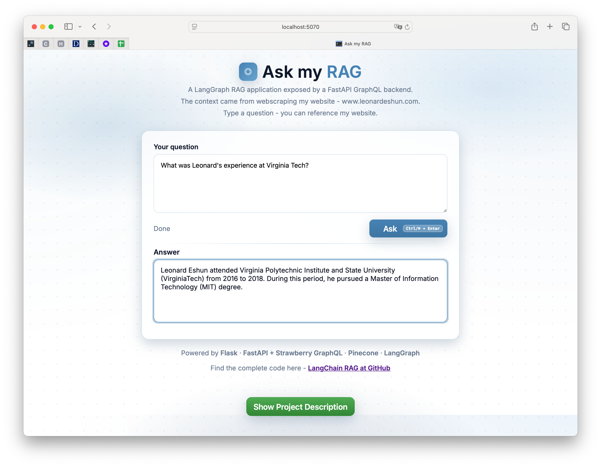
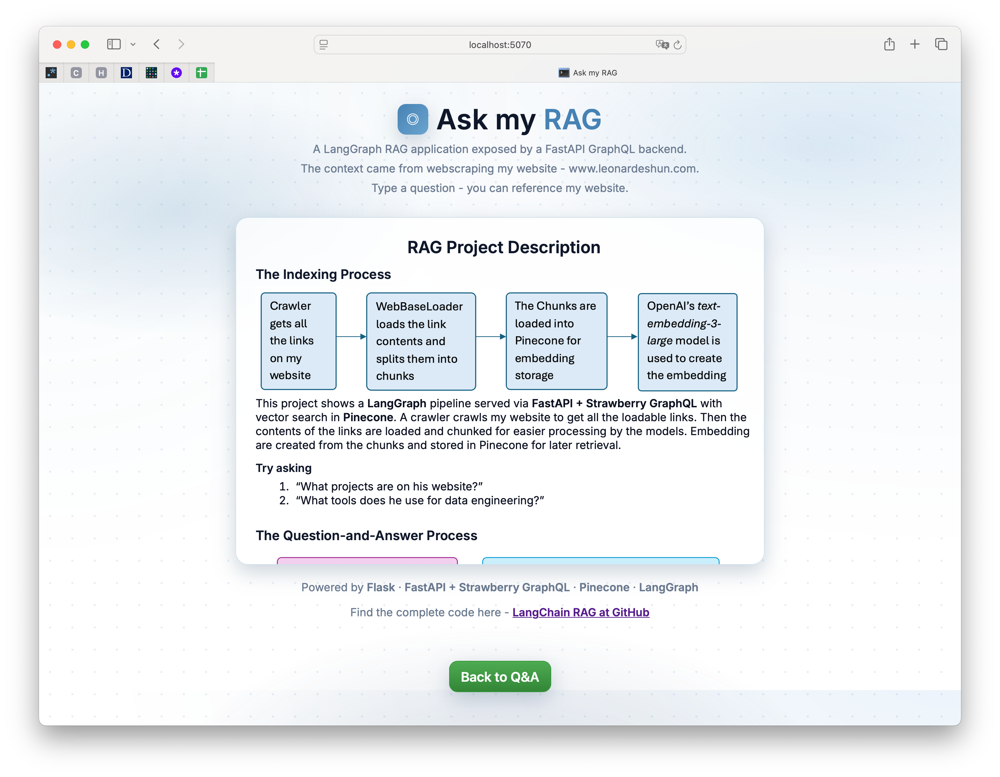
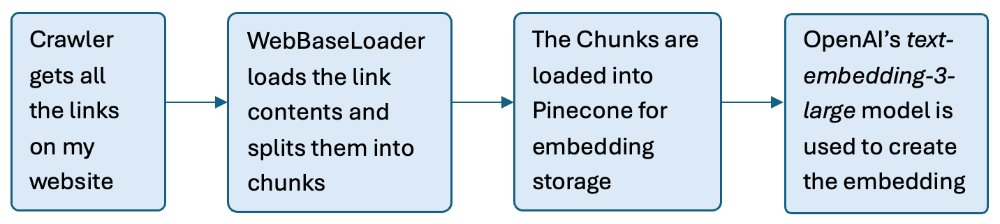
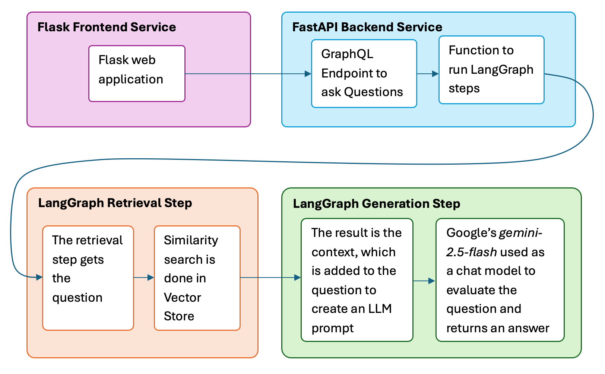
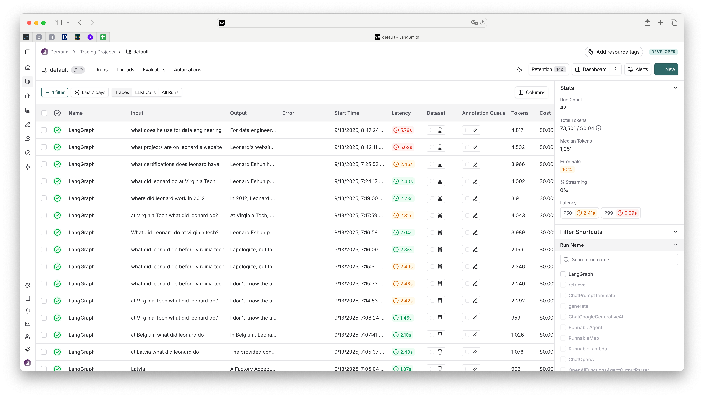
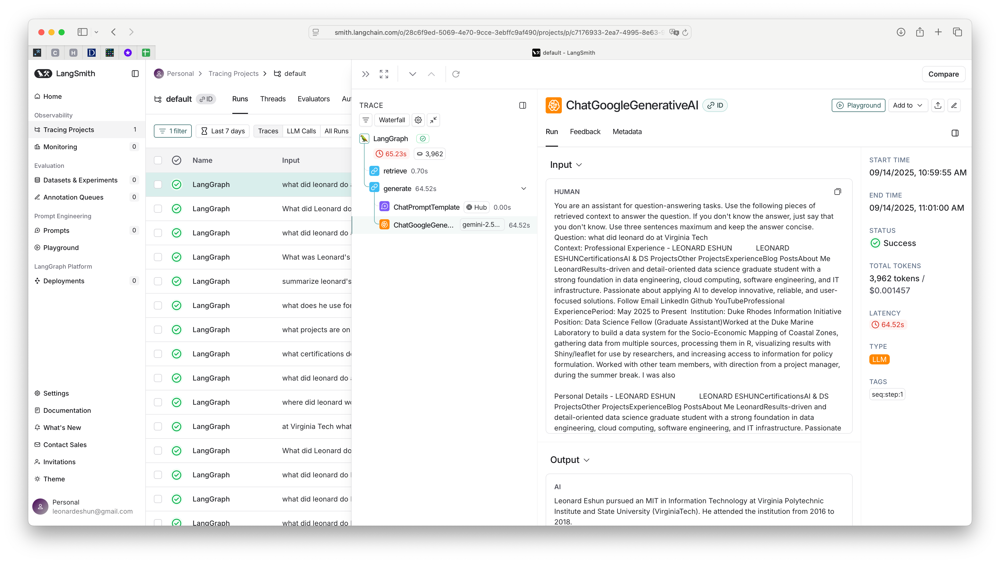

# A RAG application using LangChain
## RAG Project Description
This project shows a LangGraph pipeline served with FastAPI + Strawberry GraphQL with vector search in Pinecone and displayed via a Flask frontend application.    
### A Screenshot of the Application

A screenshot of the application is shown above. The user enters a question in the text area and clicks the "Ask" button. The question is sent to the FastAPI backend which calls the function to start executing the steps of the LangGraph. The answer is returned through the same pipeline and displayed on the Flask Frontend application.     
<br>
The RAG application uses my personal website https://www.leonardeshun.com/ as the source of information to answer questions. The website is crawled and the contents are stored in Pinecone for later retrieval.
<br>

Please find it hosted here: https://langgraph-rag.leonardeshun.com
<br>
### A Screenshot of the Description Card

A screenshot of the description card is shown above. It describes the indexing and question-and-answer processes of the application.     
<br>

### The Indexing Process

A crawler crawls my website to get all the loadable links. Then the contents of the links are loaded and chunked for easier processing by the models. Embedding are created from the chunks and stored in Pinecone for later retrieval.

### Try asking
1. “What projects are on his website?”    
1. “What tools does he use for data engineering?”    

### The Question-and-Answer Process

The question is entered into the Flask frontend application. It's sent to the FastAPI GraphQL backend which calls the function to start executing the steps of the LangGraph. An embedding is created from the question and a similarity search done in Pinecone to find semantically related text to the question.      
<br>
This is the context, and it is added to the question to create a prompt for Google's Gemini Flash chat model to generate the answers. The answer is returned through the same pipeline and displayed on the Flask Frontend application.     
<br>
This RAG application can be used for any website. Just change the website in the code on GitHub.

### To run the application
1. Clone the repository
1. Install the required packages using `pip install -r requirements.txt`
1. Set the required environment variables in a `.env` file:
   - GOOGLE_API_KEY=Your_Google_API_key
   - PINECONE_API_KEY=Your_Pinecone_API_key
   - OPENAI_API_KEY=Your_OpenAI_API_key
   - LANGSMITH_API_KEY=Your_Pinecone_environment
   - LANGSMITH_TRACING=true
1. Run the FastAPI backend using `uvicorn app.backend:app --host 0.0.0.0 --port 8000 --timeout-keep-alive 200`
1. Run the Flask frontend using `python web/frontend_app.py` for development or `gunicorn -w 4 -b 127.0.0.1:5070 "web.frontend_app:app" --timeout 300` for production.
1. Go to `http://localhost:5070` to access the application

### Deployment
I may deploy this application using Docker and hosted on a cloud platform using services like Google Cloud Run or AWS Fargate to run the Docker containers soon. Another option is to use a cloud compute service like Google Compute Engine or AWS EC2 to run the application directly on a virtual machine. However, the easiest option is to deploy it on th LangChain Hub. I'll decide soon.

I deployed it on AWS EC2 and will be deploying on Google Cloud soon. The steps to deploy on AWS EC2 are:
1. Create a free EC2 instance with a security group that allows inbound traffic on ports 80 and 443.
1. Connect to the instance via Amazon EC2 Instance Connect.
1. Clone this repository to the instance.
1. Install the required packages using `pip install -r requirements.txt`
1. Set the required environment variables in a `.env` file with the keys mentioned above.
1. Install `tmux` to keep the application running after logging out of the instance.
1. Start a new `tmux` session using `tmux new -s session_one`
1. Run the FastAPI backend using `uvicorn app.backend:app --host 0.0.0.0 --port 8000 --timeout-keep-alive 200`
1. Detach that session (Ctrl + B then d) and start a new `tmux` session using `tmux new -s session_two`
1. Run the Flask frontend using `gunicorn -w 4 -b 127.0.0.1:5070 "web.frontend_app:app" --timeout 300`.   
1. Enable port forwarding from port 80 to port 5070 using `sudo iptables -t nat -A PREROUTING -p tcp --dport 80 -j REDIRECT --to-port 5070` or let the security group handle allow port 5070. 
1. Access the application via the public IP address of the EC2 instance.
Note: You can setup a domain name and SSL certificate for better security. You could use Nginx for reverse proxy and Let's Encrypt for the certificate. They require a real domain name.


### Why LangGraph?
The RAG application could have been done without LangGraph. However, I chose LangGraph to understand how it works and can be used in agentic AI designs, informing my design options in the future. It also has LangSmith, which traces all activites on the application and gives insight on what is going on. See the screenshot below of the tracing of the application on LangSmith but can't be used with a free account :).    
   

We can see the steps of the application and how long each step took. This is useful for debugging and optimizing the application. We can also see the inputs and outputs of each step, which is useful for understanding how the application works.
   

There are more benefits of using LangGraph when designing more complex agentic applications and state management is important.     

### Note
You'll need the necessary API keys and access to the services used in this project in your environment to run it.
I recommend using a virtual environment for better dependency management. The process is:
```
python3.13 -m venv .venv
source .venv/bin/activate
pip install -U pip
pip install -r requirements.txt
```

### Technologies Used
- LangSmith
- LangGraph
- FastAPI
- Strawberry GraphQL
- Flask
- Pinecone
- Google Gemini Flash 2.5 model
- Python
- HTML/CSS/JavaScript
- OpenAI's text-embedding-3-large model
- BeautifulSoup
- Python-dotenv